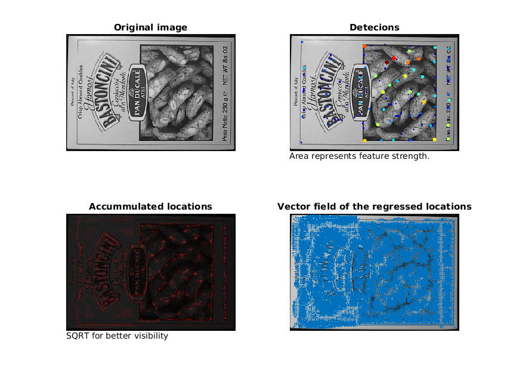

# Learning Covariant Feature Detectors
*Karel Lenc and Andrea Vedaldi*

A source code and network models for a translation covariant detector presented in
["Learning Covariant Feature Detectors"](https://arxiv.org/abs/1605.01224).
Written in MATLAB using the MatConvNet library.

This code depends on [VLFeat](http://www.vlfeat.org/) and 
[MatConvNet](http://www.vlfeat.org/matconvnet/) library. The script `setup.m`
attempts to download and install those if the libraries are not in the MATLAB
path. The script `setup.m` also downloads the model files.

Currently contains the following models:
* `./nets/detnet_s1.mat` Densely evaluation model DetNet-S
* `./nets/detnet_s2.mat` DetNet-S evaluated with stride 2
* `./nets/detnet_s4.mat` DetNet-S evalyated with stride 4

An example how to run the detector is shown in `example.m` which produces the
following figure.

